<div align="center">

# ReconPro v11

**Pure-Python security reconnaissance engine — 28 modules, 81 commands, zero-hype releases.**

[](https://github.com/falconxa0-commits/reconpro/actions/workflows/ci.yml)
[](https://github.com/falconxa0-commits/reconpro/actions/workflows/security.yml)
[](https://github.com/falconxa0-commits/reconpro/actions/workflows/sdks.yml)
[](https://github.com/falconxa0-commits/reconpro/actions/workflows/release.yml)
[](https://pypi.org/project/reconpro/)
[](https://pypi.org/project/reconpro/)
[](https://pypi.org/project/reconpro/)
[](LICENSE)

[Quickstart](#quickstart-–-60-seconds) · [Install](#installation) · [Screenshots](#screenshots) · [Tutorials](docs/TUTORIALS.md) · [Roadmap](docs/ROADMAP.md)

</div>

---

**ReconPro v11.1.0** is a pure-Python security reconnaissance platform:
remote and local scanning, a sandboxed plugin SDK, machine-readable output
(JSON / SARIF / MD / HTML) for CI/CD pipelines, MITRE ATT&CK mapping, and
reproducible, signed releases. Driven by `rich`, strict about arguments,
fast to start (~46 ms cold).

- **28 scan modules** — recon, auth bypass, chain hunter, bot hunter,
  Gorgon, Oblivion, VibeSec, NHI graph, Pegasus, cloud recon, quantum
  fingerprinting, dark-web monitoring, info-ops, steganography, covert
  channels, zero-day hunting, infra ghosting, SIGINT, nation-state
  attribution, honeypot detection, dead drops, container/IaC security, and
  more — `reconpro list`
- **81 top-level commands** — scan, audit, dev, doctor, tutorial, wizard,
  playground, suggest, plugin (sandboxed SDK), nexus, agent, swarm,
  adversarial, cve, graph, compliance, serve, report, history, diff,
  export, engineering, copilot, and ~60 more —
  see [docs/CLI_REFERENCE.md](docs/CLI_REFERENCE.md)
- **3200+ tests** (3262 collected; ~3277 test functions across 53 files)
  including 150 dedicated prompt-injection-defense tests, 34 AST+behavioural
  security-sweep tests, and a plugin sandbox-attack suite — all green in CI
- **Sandboxed plugin SDK** — separate OS process with RLIMIT_AS 128 MiB /
  CPU 10 s / FSIZE 16 MiB, an audit hook blocking subprocess/sockets/
  privilege changes/out-of-workdir writes, Ed25519 signing, and an
  install/verify/upgrade lifecycle — [docs/PLUGINS.md](docs/PLUGINS.md)
- **Strict CLI** — unknown or unrecognized arguments exit 2, always; JSON
  on stdout, human output on stderr
- **TLS verified by default** everywhere; `--insecure`/`-k` is the single,
  audited opt-out
- **Prompt-injection defense** on all AI-facing components (chat, agent,
  copilot)
- **Reproducible releases** — byte-identical wheel rebuilds, CycloneDX 1.5
  SBOM, SHA256SUMS with Ed25519 + GPG signatures, a `verify` command that
  actually detects tampering — [docs/RELEASE.md](docs/RELEASE.md)
- **Language SDKs** — Python / Node.js / Java (tested in CI and locally)
  and Go / Rust (compiled + tested on GitHub Actions runners via the
  `SDKs` workflow) — [docs/SDKS.md](docs/SDKS.md)
- **Fast startup** — ~46 ms median cold start (was ~570 ms) via lazy rich
  + lazy engine imports; CI gate at 100 ms — [docs/PERFORMANCE.md](docs/PERFORMANCE.md)

## Quickstart — 60 seconds

```bash
pip install reconpro

reconpro --version      # ReconPro 11.1.0
reconpro doctor         # health-check this machine (local, no network)
reconpro tutorial       # 8-step guided tour
reconpro scan example.com --modules recon --json --timeout 60   # (network)
```

Runnable scripts for every workflow live in [`examples/`](examples/) —
each one was executed before being committed.

## Installation

```bash
pip install reconpro          # from PyPI
```

Optional extras: `pip install "reconpro[full]"` (aiohttp, playwright,
openai/anthropic, networkx, scapy, shodan, websockets) or pick
individually: `async`, `browser`, `llm`, `graph`, `raw`, `intel`,
`collab`, `integrations`.

Runtime dependencies: `rich>=13`, `textual>=0.40`, `requests>=2.28`,
`cryptography>=41`. Python **3.10+**.

### Verifying a release (recommended)

Every release ships `SHA256SUMS` signed with Ed25519 (authoritative) plus
binary and GPG signatures, a CycloneDX 1.5 SBOM, and a build report:

```bash
# after downloading the release assets into dist/:
python tools/release_manager.py verify   # exit 0 = internally consistent
```

See [docs/RELEASE.md](docs/RELEASE.md) for the full procedure, and the
honest notes below about the sdist and the GPG public key.

## Screenshots

Real terminal captures — animated SVGs recorded from actual runs (see
`docs/screenshots/`; regenerate any of them with the commands shown):

<table>
<tr>
<td width="50%">

**The command surface** — `reconpro --help`



</td>
<td width="50%">

**The module catalog** — `reconpro list`


</td>
</tr>
<tr>
<td width="50%">

**A live scan** — `reconpro ports`


</td>
<td width="50%">

**Machine audit** — `reconpro doctor`



</td>
</tr>
</table>

## Use it in CI — SARIF in ~10 lines

```yaml
- uses: falconxa0-commits/reconpro/actions/reconpro-scan@v11.1.0
  with:
    target: .
```

The composite action runs AST analysis + secrets + project scan, exports
SARIF 2.1.0, uploads the artifact and ingests it into GitHub Code
Scanning. Tutorial: [docs/TUTORIALS.md](docs/TUTORIALS.md#t3--sarif-in-ci-github-actions).

## Python API

```python
from reconpro import scan, audit_scan, __version__

result = audit_scan(".")                     # local, no network
print(result.total_score, result.grade)      # 0-100, A+..F
print(result.severity_counts)                # {'critical': 3, ...}

result = scan("example.com", modules=["recon"], timeout=60)   # (network)
```

## Documentation

| Document | Contents |
|---|---|
| [docs/TUTORIALS.md](docs/TUTORIALS.md) | quickstart tutorials: first scan, machine audit, SARIF in CI, first plugin, SDKs |
| [docs/GETTING_STARTED.md](docs/GETTING_STARTED.md) | install, first scan, doctor, tutorial, wizard, suggest — with real outputs |
| [docs/CLI_REFERENCE.md](docs/CLI_REFERENCE.md) | every one of the 81 subcommands: usage, options tables, examples, exit codes |
| [docs/PLUGINS.md](docs/PLUGINS.md) | plugin SDK: sandbox guarantees, permissions, manifest, signing, lifecycle |
| [docs/SECURITY.md](docs/SECURITY.md) | strict CLI, TLS-by-default, shell-free execution, safe archives, prompt defense |
| [docs/RELEASE.md](docs/RELEASE.md) | release_manager.py, SBOM, checksums, signatures, reproducibility, CI workflows |
| [docs/SDKS.md](docs/SDKS.md) | the five language SDKs and their status |
| [docs/IDE.md](docs/IDE.md) | VS Code / JetBrains / Neovim / GitHub Action / GitHub App |
| [docs/PERFORMANCE.md](docs/PERFORMANCE.md) | startup numbers, benchmark tool, CI gate, lazy-import architecture |
| [docs/ROADMAP.md](docs/ROADMAP.md) | v11.2.0 and beyond: enterprise, plugin marketplace, cloud dashboard, teams |
| [CONTRIBUTING.md](CONTRIBUTING.md) | developer onboarding: setup, gates, style, releasing |

## Repository layout

```
reconpro/            the package (28 modules, CLI, engine, plugin SDK, tests)
examples/            runnable CLI + Python examples (executed before commit)
docs/                documentation + screenshots/ (real terminal captures)
tools/               release_manager, bench_startup, security_scan, chunked-test runner
sdks/                python / node / java / go / rust SDKs
ide/                 vscode / jetbrains / neovim integrations
actions/             composite GitHub Action (reconpro-scan)
github-app/          GitHub App manifest + webhook receiver
.github/workflows/   ci.yml · security.yml · sdks.yml · release.yml · reconpro-scan.yml
dist/                signed release artifacts (wheel, sdist, SBOM, SHA256SUMS, signatures)
```

## Honest status notes

- **The repository is live and CI is green.** All five workflows (`CI`,
  `Security`, `SDKs`, `Release`, `ReconPro Scan`) pass on `main`; history
  includes failed-and-fixed runs — nothing is hidden, see the Actions tab.
- **The test suite runs in CI chunks**: the full suite in one pytest
  invocation hangs (known issue); a handful of files are excluded with
  documented reasons (see `tools/ci_test_groups.txt`).
- **The wheel is byte-reproducible; the sdist is not** (tar/gzip
  nondeterminism under the setuptools backend) — verify sdist integrity via
  the signed `SHA256SUMS`; details in the release manifest.
- **GPG signature caveat**: releases ship `SHA256SUMS.asc`, but the GPG
  public key is not yet published — third-party verification today rests on
  the Ed25519 signatures (public key in `tools/keys/release_key.pub`).
  Publishing the GPG key is on the [roadmap](docs/ROADMAP.md).
- **Go/Rust SDKs are CI-verified** on GitHub Actions runners (the `SDKs`
  workflow compiles and tests them with real toolchains); a dev sandbox
  without toolchains gets an honest `exit 3 ENVIRONMENT BLOCKED` from
  `smoke.sh`. The **JetBrains plugin remains structurally validated only**
  (no IDE host) — see [docs/IDE.md](docs/IDE.md).

## Roadmap

Next up (v11.2.0): sdist byte-reproducibility, GPG key publication,
stricter lint, one-shot pytest, Windows/macOS CI matrix, report themes,
CIS/STIG compliance packs. Beyond: enterprise RBAC + audit streams, a
signed **plugin marketplace**, a **cloud dashboard** over the same engine,
and **team management** — full plan in [docs/ROADMAP.md](docs/ROADMAP.md).

## Contributing

See [CONTRIBUTING.md](CONTRIBUTING.md) — setup, the four CI gates to run
locally, code style, and the project's one rule: *repository reality is
the only truth*.

## License

MIT © ReconPro Security. See [LICENSE](LICENSE).
